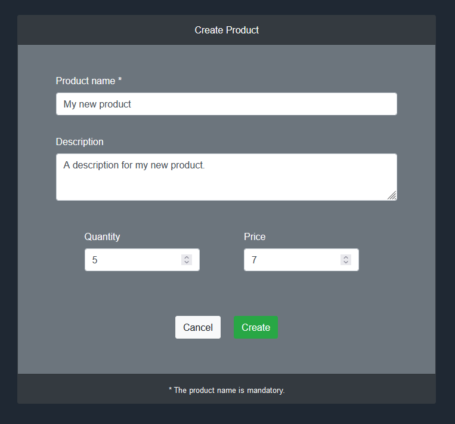
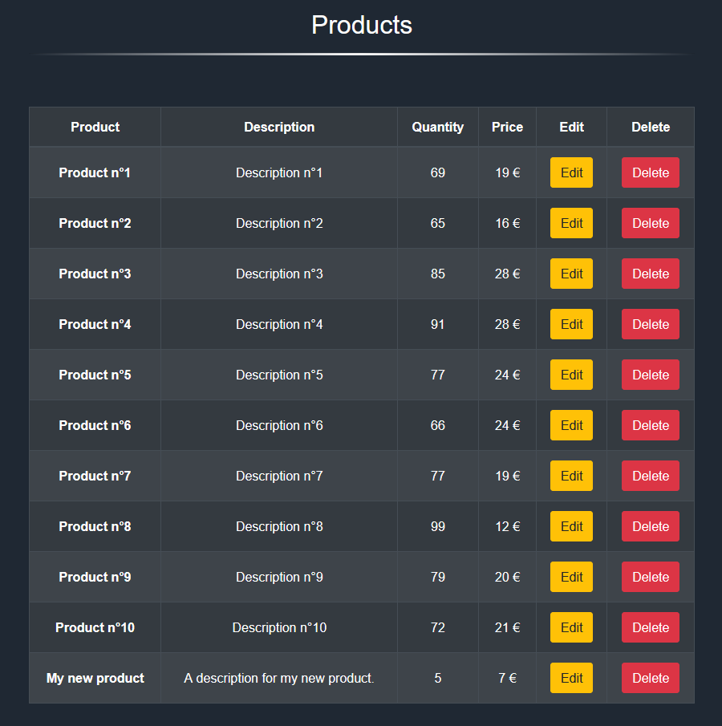

# REST Client

Use REST Server to manage its resources.

To respect REST standards, this client is built independently of
my [REST Server](https://github.com/kserbouty/rest-server)
and communicate only through endpoints. It uses the library Axios to manage requests and responses with AJAX.

### Technologies

- Vue 2.6
- Vue Router 3.2
- Axios 0.21
- Bootstrap 4.6

### Visuals

*Create a new product*



*Read products from the database*



## Installation

### Requirements

- Node 17+ with npm
- [REST Server](https://github.com/kserbouty/rest-server) running on <http://localhost:8000>

### Manual installation

Clone the repository :

```bash
git clone https://github.com/kserbouty/rest-client.git
```

Switch to the repository folder :

```bash
cd rest-client
```

Install all the dependencies witch npm :

```bash
npm install
```

Run a local server :

```bash
npm run serve
```

Ports set for <http://localhost:8080>.

### Docker installation

To run with Docker, follow these commands :

```bash
git clone https://github.com/kserbouty/rest-client.git
cd rest-client
docker compose up -d --build
```

Ports set for <http://localhost:8080>.

## License

[MIT](./LICENSE.md)

## Project status

*Completed*
